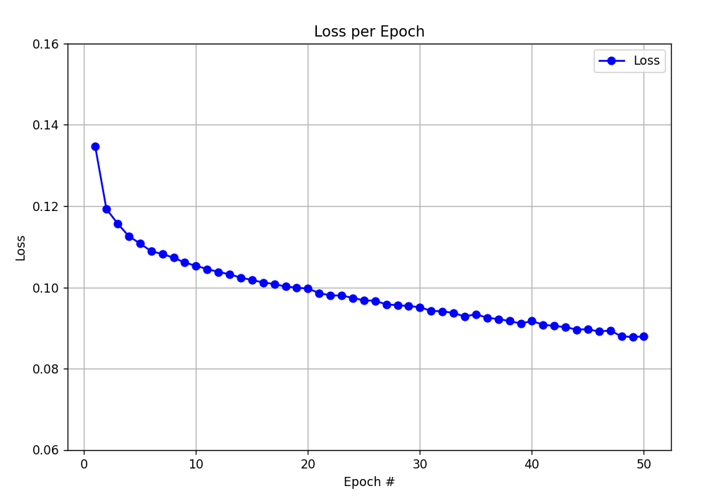
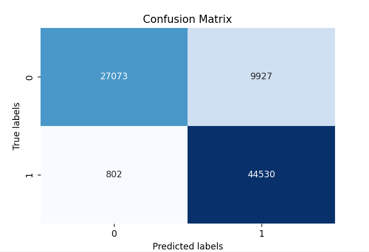
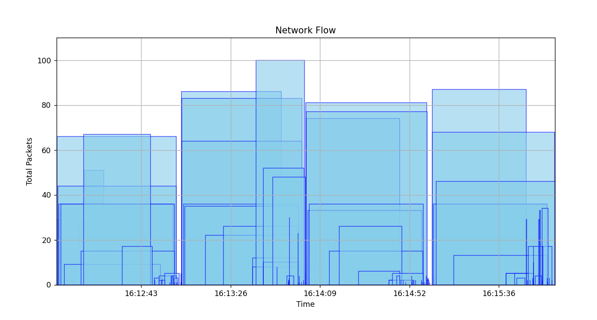
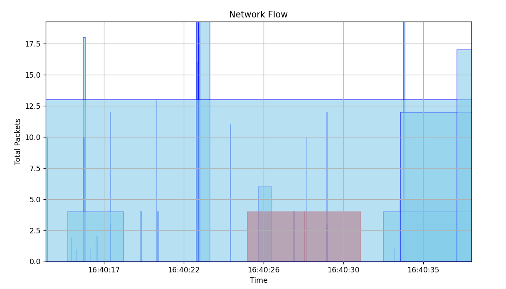
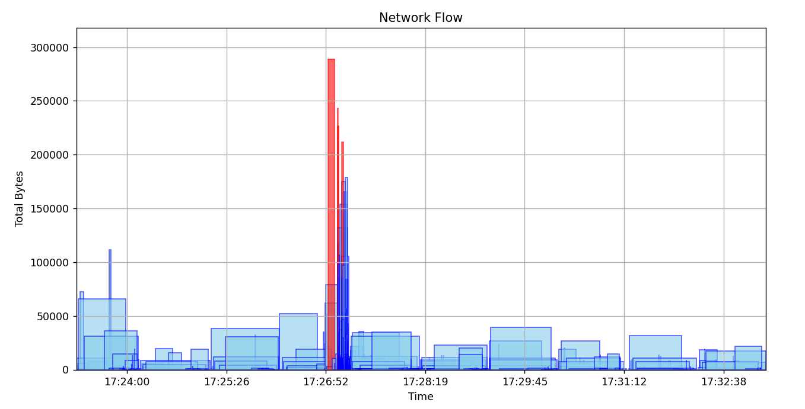

# Waterwall  
> Linux Firewall Tool and Network Monitor

### Features
- Update your firewall rules through a simple command line utility
- Built-in machine learning to automatically detect attacks
- Visualize network flows, rather than packets, allowing greater control over your network

### Getting Started
Ensure you have the latest version of [conda](https://docs.conda.io/en/latest/) installed and are using a Linux distribution, preferably [Ubuntu](https://ubuntu.com/download). Navigate to a source directory of your choice and run these commands:
```bash
git clone https://github.com/thisdotmatt/Waterwall.git
cd Waterwall
conda env create -f environment.yml
conda activate waterwall_env
cd waterwall
```

Run `sudo python3 firewall.py --help` to see the options for changing your firewall rules from the command-line.
To run the automated threat detection, use the following:
```
chmod +x run.sh
./run.sh
```
After you've collected several minutes of data using the automated threat detection, use `python3 visualize.py` or check `monitor.log` to view the status of your network.

### How It Works
A key part of this project is the threat detection system, which uses a machine-learning model paired with a network sniffer to determine the health of a particular network. Specifically, there are four steps to this process:
1. Using scapy, a network analysis library in Python, the system retrieves all packets entering and leaving the host computer.
2. Packets are grouped together by similar characteristics to form "network flows."
3. A pre-trained convolutional neural network (CNN) interprets the flow as "Malicious" or "Normal"
4. The state of the network is logged for later analysis

### Training Details
For the machine learning model component of the project, I wanted a model that would have low-latency, while maintaining decent accuracy. I selected a custom CNN as the model, and utilized a well-known dataset called [USNW-NB15](https://research.unsw.edu.au/projects/unsw-nb15-dataset). Each entry in the dataset contains details about a network flow, including its duration, number of packets, and protocol used, as well as a label for whether an attack (e.g. DoS, Worm) occurred during this network flow. If no attack was happening, the label is "Normal." The model and training script were built using PyTorch.
<br><br>
**Devices**: Quadro RTX 6000 GPU x4<br>
**Epochs**: 50<br>
**Duration**: 20 minutes<br>
**Accuracy**: 0.8697<br>
**Precision**: 0.8177<br>
**Recall**: 0.9823<br>
**F1 Score**: 0.8925<br>

<br>
<i>Loss curve decreasing as the model learns</i><br><br>
<br>
<i>0 = Normal, 1 = Malicious</i><br><br>

**Note**: Although the accuracy is fairly high for such a short training period, there are severe limitations to USNW-NB15. The dataset has over 2 million "Normal" activity data points as compared to only about 250,000 "Malicious" activity data points. The effect of this can be seen in the imperfect confusion matrix. In future work, I intend to find a less skewed dataset or construct my own.

### Experiments
To test whether the monitoring system could perform well in a real-world scenario, I evaluated it using two types of malicious activities: Denial-of-Service (DoS) and network scanning. Whereas DoS often involves large quantities of packets designed to disable a network, network scanning tools are often more subtle and harder to detect. Thus, they represent a good range of potential attacks.
<br><br>I first ran my monitoring tool for several minutes to gather a baseline. Then, I used the nmap utility to perform a full network scan of my private network with the goal of triggering Waterwall's warning system. Finally, I used scapy to generate an enormous number of large packets, simulating a DoS attack. The results of each are shown below, with the malicious flows in red.

<br>
*Typical Network Activity*
<br>
<br>
<br>
*Someone is scanning our network for weaknesses!*
<br>
<br>
<br>
*A malicious actor is flooding the network with packets to shut it down*

### Disclaimer
This project was designed for learning purposes, to explore the potential capabilities of cybersecurity when paired with machine learning. This should not serve as a replacement for more mature network security tools, but rather as a supplement. Ignoring this disclaimer puts you at your own risk.